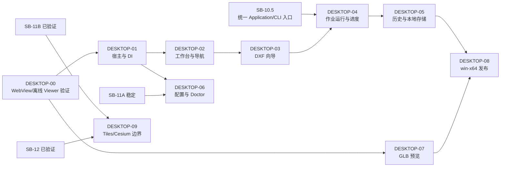

# Scene Builder Avalonia Desktop 路线图（规划）

## 基线与目标

本文是 Windows 10/11 桌面 MVP 的路线图，不是已实现功能清单。当前事实基线：SB-11A 已在 `main` 当前提交中；SB-11B 仍为工作区中的未提交工作，桌面文档不将其计为完成，也不把它纳入本路线图的交付声明。桌面端不会创建/修改 CAD、SceneDraft、Blender、资产映射或 `JobReport v0`。

桌面 MVP 只服务 DXF。DWG 显示“暂不支持”；3D Tiles/Cesium 是后续独立增量，不属于当前桌面交付。总体设计、页面设计和作业设计分别见 [总体设计](superpowers/specs/2026-07-30-scene-builder-avalonia-desktop-design.md)、[页面设计](superpowers/specs/2026-07-30-scene-builder-desktop-ui-pages.md) 和 [作业与存储设计](superpowers/specs/2026-07-30-scene-builder-desktop-job-and-storage-design.md)。

## 阶段依赖

SB-10.5 是桌面转换接入的硬前置：它必须提供并验证统一 `SceneConversionService`/CLI 入口。资产配置 UI 只在 SB-11A 稳定后接入。DESKTOP-09 只在 SB-11B、SB-12 已验证后讨论 3D Tiles/Cesium，且仍需独立 POC；它不倒推当前支持状态。

## 任务序列

| 卡片 | 规划目标 | 主要退出条件 |
| --- | --- | --- |
| [DESKTOP-00](task-cards/DESKTOP-00-桌面技术验证.md) | 验证 WebView、离线 Three.js、通信、释放与发布 | 成功选型或记录外部查看器回退 |
| [DESKTOP-01](task-cards/DESKTOP-01-桌面宿主与依赖注入.md) | Avalonia Shell、MVVM、DI 边界 | Domain 无 Desktop 依赖 |
| [DESKTOP-02](task-cards/DESKTOP-02-工作台与导航.md) | 工作台和统一导航 | 页面状态/键盘导航可测 |
| [DESKTOP-03](task-cards/DESKTOP-03-新建转换向导.md) | DXF-only 新建向导 | DWG 禁止启动，预检明确 |
| [DESKTOP-04](task-cards/DESKTOP-04-作业运行与进度.md) | 单并发、进度、取消、关闭确认 | 仅经 SB-10.5 入口调用 |
| [DESKTOP-05](task-cards/DESKTOP-05-任务历史与本地存储.md) | JSON/目录历史与恢复 | JobId 隔离、无数据库 |
| [DESKTOP-06](task-cards/DESKTOP-06-配置与系统检查.md) | 设置、Doctor、资产配置入口 | 不安装/捆绑外部工具 |
| [DESKTOP-07](task-cards/DESKTOP-07-GLB预览.md) | 已验证 GLB 的安全预览 | Viewer 失败有明确回退 |
| [DESKTOP-08](task-cards/DESKTOP-08-Windows发布.md) | `win-x64` self-contained ZIP | 解压运行与证据完成 |
| [DESKTOP-09](task-cards/DESKTOP-09-3DTiles与Cesium边界.md) | Tiles/Cesium 后置边界 | 未验证前不宣称支持 |

## 共通质量门

- 所有新增文本为 UTF-8；文档、日志与 UI 不泄露现场数据、凭据、客户标识或机器绝对路径。
- 运行时产物只进入调用方明确的作业输出目录/未来 LocalAppData 作业根，绝不写入仓库根、`src/` 或 `tests/`。
- 每卡实施前后执行相关单元/集成/UI 测试；发布卡额外在 Windows 10/11 手工验证启动、Doctor、DXF、取消和预览/回退。
- 任何 POC 未通过、外部工具缺失或取消失败时，只记录未配置/失败证据，不把能力标为已支持。
