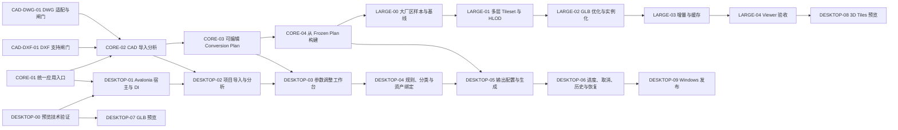

# Scene Builder Avalonia Desktop 路线图

## 重基线

本路线图面向“导入、分析、调整、生成、预览、发布”的 Windows 本地场景构建产品。它以现有底层能力为起点，但不把底层测试、SmokeTest 或 POC 表述为已有 Desktop 产品。当前没有 Avalonia 项目、完整转换 CLI、统一 Application 服务或 Analyze/Plan/Build 入口。

DXF 是第一条验收路径。DWG 是产品目标输入，但在受控转换器、许可、取消、超时、Xref、代理对象和真实样本闸门完成前保持 Unsupported。单体 GLB、Scene Package 和本地 Cartesian 3D Tiles 1.1 是可选择输出；内嵌预览均需独立 POC。

## 依赖顺序

## 任务卡

| 顺序 | 任务 | 退出条件 |
| --- | --- | --- |
| 1 | CORE-01 统一应用层转换入口 | CLI 与 Desktop 调用同一服务；Desktop 不直连 CAD/Blender/Tiles；进度与取消契约明确。 |
| 2 | CORE-02 CAD 导入分析 | 可返回受控 `CadImportAnalysisResult`，分析不启动 Blender。 |
| 3 | CORE-03 可编辑 Conversion Plan | Analysis → Draft → Validation → Frozen Plan 具备版本和确定性。 |
| 4 | CORE-04 Frozen Plan 构建 | 冻结计划可选择生成 GLB、Scene Package、3D Tiles。 |
| 并行 | CAD-DXF-01 | 真实匿名 DXF、重复性、取消与实体覆盖完成支持闸门。 |
| 并行 | CAD-DWG-01 | DWG Adapter 和受控转换的许可、Xref、代理对象、取消、超时与真实样本闸门完成。 |
| 5 | DESKTOP-00 | 分别验证二维 CAD、GLB WebView、3D Tiles WebView，失败有受控回退。 |
| 6 | DESKTOP-01 至 09 | 按任务卡依次交付宿主、工作台、输出、历史、预览与发布。 |
| 大厂区 | LARGE-00 至 04 | 在 CORE-04 后，以真实样本、HLOD、优化、缓存和 Viewer 验收逐步推进；SB-12A 仅为输入基础。 |
| 最后 | INTEGRATION-01 | 仅在统一 Application 服务和 Desktop 稳定后评估 IDTS API/Web 接入。 |

所有实现必须保持 Domain 独立；不得把 ACadSharp、Avalonia、Blender 或具体 Tiles 转换器引入 `SceneBuilder.Domain`。运行时产物只可写入明确的作业输出目录或未来 `%LocalAppData%/SceneBuilder` 根，绝不写入仓库、`src/` 或 `tests/`。
