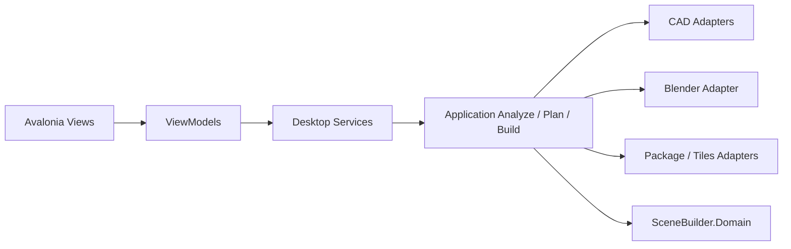

# Scene Builder Avalonia Desktop 总体设计

## 定位

Avalonia Desktop 是规划中的 Windows 本地场景构建产品端，不是当前仓库已经提供的程序。它消费 CORE-01 至 CORE-04 的统一 Application 工作流，带领用户完成导入、分析、调整计划、冻结、生成、预览和结果管理。

DXF 是首条验收路径。文件选择可显示 DWG 和 DXF，但 DWG 的操作严格受支持状态控制：未配置转换器时显示“DWG 转换器未配置”，支持闸门未通过时显示“DWG 支持仍在验证”，均不得启动作业。当前底层 Scene Package 与本地 Cartesian 3D Tiles 1.1 的实现不等于已有 Desktop 或 Cesium/IDTS 产品能力。

## 架构边界

Desktop 只调用统一 Application 服务并显示只读结果快照。ViewModel 不得调用 CAD、`CadRuleEngine`、`SceneDraftBuilder`、Blender 或 Tiles；Domain 不得依赖 Avalonia、Desktop Services、ACadSharp、Blender、WebView 或具体 Tiles 转换器。组合根注册导航、对话框、文件选择、设置、项目存储、作业调度、Doctor 和预览服务。

## 作业、预览和发布

项目根使用 `%LocalAppData%/SceneBuilder` 的 Project/Analysis/Plan Revision/Build Job/Artifact 层级；Build 一律消费 Frozen Plan，输出隔离且不覆写历史。`JobStatus`、`JobStage`、`JobProgress` 分别建模；取消协作传播，窗口关闭需要确认并等待受控收敛。

DESKTOP-00 分别验证二维 CAD、GLB 和 3D Tiles 预览。只有相应 POC 成功后，才允许内嵌预览已验证且在作业根内的白名单产物；失败路径使用受控外部查看器。Windows 发布目标为 `win-x64` self-contained ZIP，不打包 Blender、样本、凭据或本地作业数据。

## 验收

自动化测试覆盖导航、计划校验、作业状态、目录隔离、取消与恢复；集成测试覆盖 CORE 入口的进度/取消映射；手工验收覆盖 Windows 10/11、高 DPI、DWG 状态提示、预览回退和发布 ZIP。所有文本和 JSON 必须为 UTF-8，所有运行时产物必须位于受控根目录。
