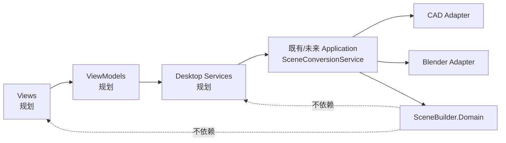
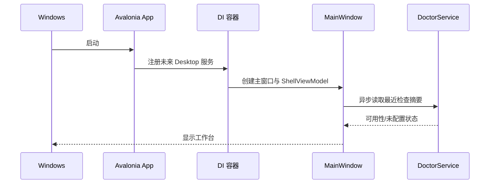

# Scene Builder Avalonia Desktop 总体设计（规划）

## 定位与范围

本文定义 Windows 10/11 上的 **规划中** Scene Builder 桌面 MVP。它是未来对既有转换能力的本地操作入口，不是当前仓库已经提供的桌面程序。当前已实现事实仍以现有命令、测试和任务卡为准；尤其 `JobReport v0`、现有 CAD/Blender 流水线和资产映射不因本文而改变。

MVP 面向 DXF：用户选择 DXF、规则和明确的本地作业输出位置，查看诊断、日志和 GLB 产物。DWG 在界面中明确显示“暂不支持”，不尝试调用探针或伪造转换结果。Web/API 仅是未来 IDTS 集成或多人场景的适配方向，不属于桌面 MVP。

**MVP 包含**：本地工作台、作业创建与历史、系统检查、设置、GLB 预览验证和 Windows 发布方案。**MVP 不包含**：DWG 转换、3D Tiles/Cesium、自动更新、云同步、账号、多用户协作、数据库、打包 Blender 或改造领域/转换契约。

## 架构与边界

未来新增项目暂定为 `SceneBuilder.Desktop`，目标框架、具体 Avalonia 版本和包版本在 DESKTOP-00 验证成功后才固定。首选 MVVM 方案为已评估的 `CommunityToolkit.Mvvm`；这只是未来实现选择，当前未引入 NuGet 包。应用启动处配置 DI，注册窗口、导航、对话框、文件选择、设置、Doctor、作业存储、作业运行器和预览服务。



调用只可从 Desktop 向 Application/Adapter 前进；`SceneBuilder.Domain` 不引用 Avalonia、Desktop Services、ACadSharp、Blender、WebView 或具体 Tiles 转换器。桌面端不得在 ViewModel 中拼接 CAD、SceneDraft 或 Blender 阶段；它只构造一次应用层请求并显示受控结果。

未来公共边界以应用层统一服务为准，名称和字段须在 SB-10.5 实施时确认：

```csharp
// 规划接口：尚未存在，不构成当前公开 API。
public interface ISceneConversionService
{
    Task<SceneConversionResult> ConvertAsync(
        SceneConversionRequest request,
        IProgress<SceneConversionProgress> progress,
        CancellationToken cancellationToken);
}
```

桌面端未来只依赖这一入口和只读结果模型；不能绕过它直接调用 CAD/Blender。SB-10.5 必须先交付并验证统一 Application/CLI 入口，DESKTOP-03/04 才可接入。

## 启动、DI 与页面导航



启动不得阻塞 UI 线程执行 Blender、文件扫描或转换。导航服务维护 Shell 当前页面；页面只通过 ViewModel 命令请求导航或对话框，避免 ViewModel 持有 `Window`。可能的未来服务为 `INavigationService`、`IDialogService`、`IFilePickerService`、`ISettingsService`、`IDoctorService`、`IDesktopJobStore`、`IDesktopJobRunner`、`IGlbPreviewService`，均定义在 Desktop 边界内。

## 作业、预览与发布决策

DesktopJobRunner 是规划中的单并发协调器，显示的 `JobStatus`（作业结果）、`JobStage`（当前阶段）与 `JobProgress`（进度快照）必须分离建模，不能将 UI 文案或百分比写回 `JobReport v0`。它在 UI Dispatcher 上发布快照；取消仅请求协作式取消，并由应用层负责停止启动新外部进程及收敛已启动进程。窗口关闭时，存在 queued/running 作业必须二次确认；确认后请求取消并等待受控收尾，不强杀 Blender。

GLB 预览是 DESKTOP-00 的技术验证：优先验证 WebView + 应用随附的离线 Three.js Viewer、.NET/JS 通信、文件访问白名单、资源释放以及 Windows 发布行为。验证前不指定 WebView 控件或打包方案。若任一关键验收失败，MVP 回退为打开受控产物目录中的外部 GLB 查看器或已配置 Blender；回退不把 Blender 作为随程序分发组件。

发布目标是 `win-x64` self-contained ZIP；具体 runtime identifier、签名与压缩方式在发布卡实施前确认。Blender 不随包分发，用户在设置中提供路径并由 Doctor 验证。自动更新不进入 MVP。

## 测试、风险与验收

- 单元测试：导航状态、设置校验、作业状态转换、目录隔离、取消与关闭确认；使用 Application/Blender 的替身，不在 UI 单元测试中启动外部进程。
- 集成测试：SB-10.5 入口的请求/进度/取消映射、Doctor 的已配置与未配置结果、作业 JSON 恢复；测试产物使用临时输出目录。
- 手工验收：Windows 10/11 启动、键盘导航、缩放、DXF-only 提示、单作业互斥、失败日志、预览释放与 ZIP 解压运行。
- 风险：WebView 运行时或离线 JS 通信不可验证时，采用外部查看器回退；Blender 并发或遗留进程风险由单并发与现有受控进程边界缓解；本地敏感文件由不复制输入原件以外的最小范围、相对路径和日志脱敏约束缓解。

对应分解、前置和验收见 [Avalonia 桌面端路线图](../../scene-builder-avalonia-desktop-roadmap.md) 与各 DESKTOP 任务卡。本文描述的是规划，不代表任何 DESKTOP 卡已完成。
