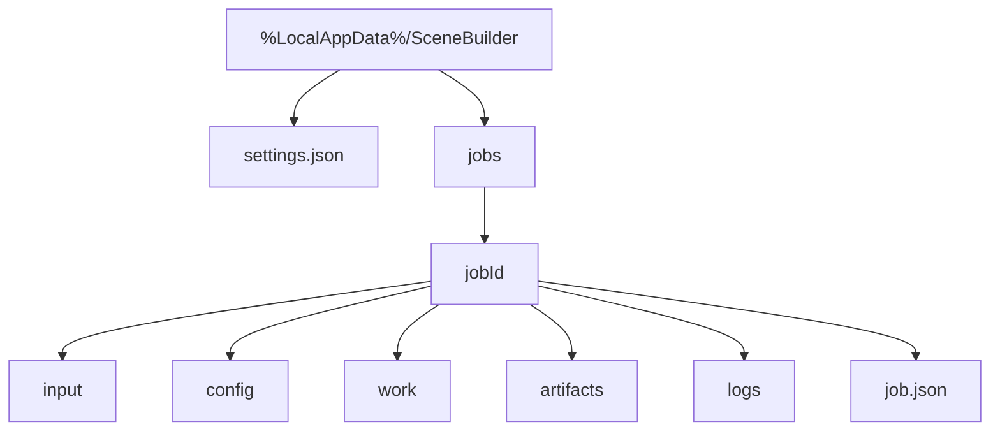
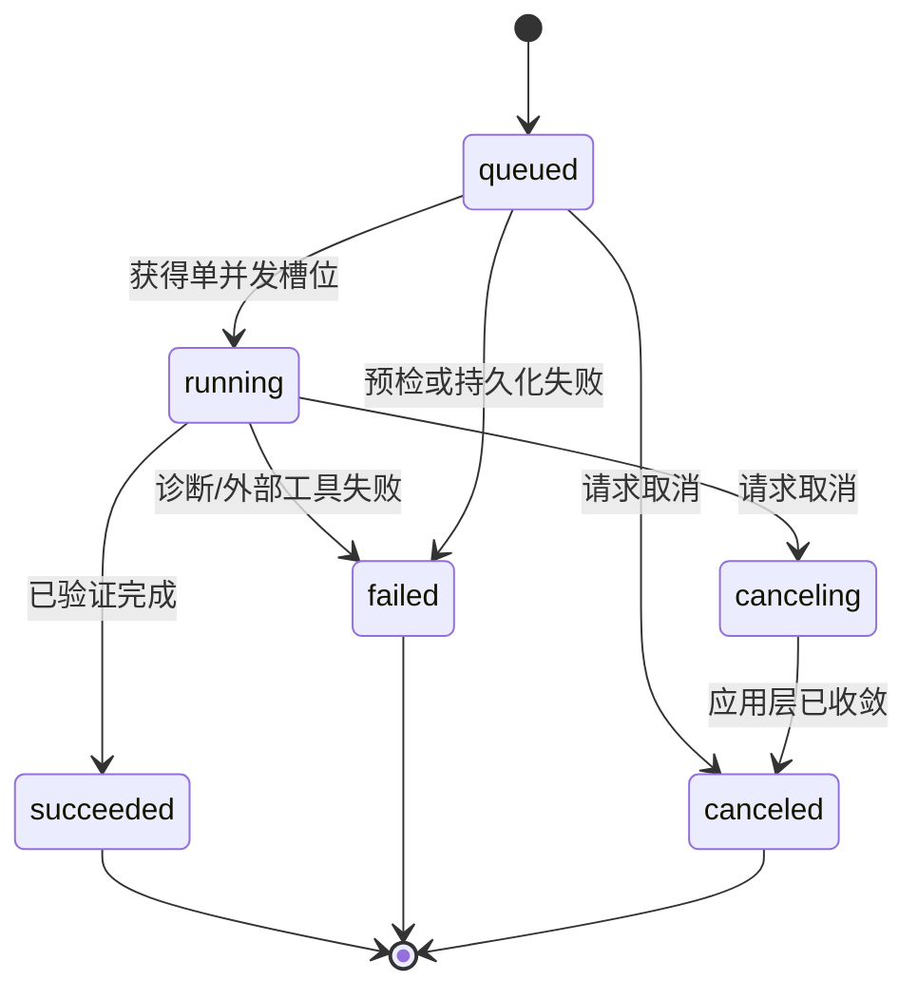
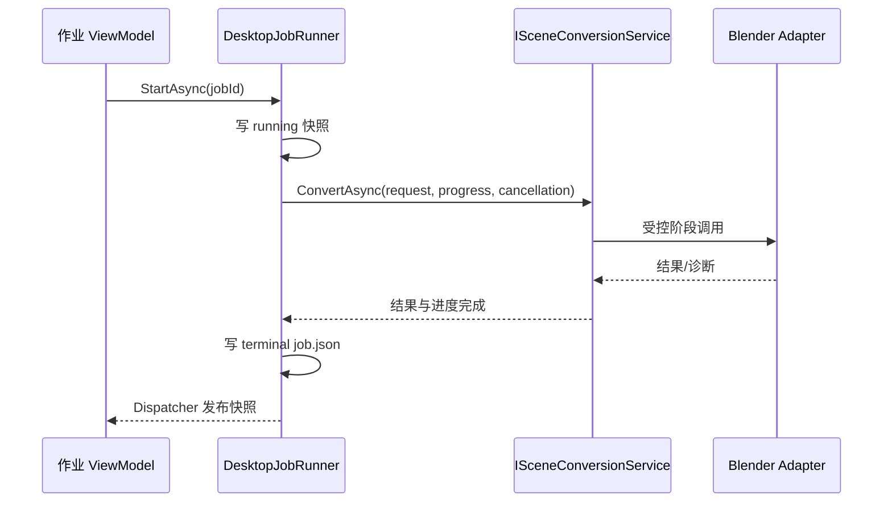

# Scene Builder Desktop 作业与本地存储设计（规划）

## 原则与目录

这是未来桌面 MVP 的本地持久化设计，**未实现**，不替换既有 CLI 作业协议，也不修改 `JobReport v0`。首版使用按 JobId 隔离的目录加 UTF-8 JSON，不引入数据库。应用数据根采用 Windows 的 `%LocalAppData%/SceneBuilder` 概念位置；本文不固定任何机器绝对路径。



`job.json` 保存桌面自己的作业元数据、状态快照、相对路径、非敏感错误摘要和创建/更新时间；它不是 `JobReport v0` 的替代或镜像。输入副本、配置快照、工作文件、产物和日志均不得逃逸对应 JobId 目录。服务必须拒绝空 JobId、`..`、路径分隔符、Windows 设备名和解析后不在根目录内的目标；不得把运行时文件写回仓库、`src/` 或 `tests/`。

规划中的最小 JSON 形状如下，字段名、版本和迁移策略在 DESKTOP-05 实施时最终确定：

```json
{
  "formatVersion": 1,
  "jobId": "opaque-safe-id",
  "status": "queued",
  "createdAtUtc": "2026-07-30T00:00:00Z",
  "input": "input/source.dxf",
  "config": "config/rules.json",
  "artifacts": [],
  "log": "logs/desktop.log"
}
```

`settings.json` 只保存界面偏好、经校验的工具路径引用和默认作业策略；不保存密码、令牌、图纸内容或客户标识。写入采用临时文件加原子替换；损坏 JSON 只影响该配置/记录并产生可读诊断，不能阻止用户打开系统检查或查看其他作业。

## 作业模型与执行



`JobStatus` 表示上述持久化生命周期；`JobStage` 表示当前转换阶段；`JobProgress` 是瞬态进度快照。三者不能合并为一个字符串，也不得反向写入领域对象或 `JobReport v0`。`IDesktopJobRunner` 规划为单例单并发：先写 queued，再依序调度；任何 Blender 相关工作同一时间最多一个。状态更新经 UI Dispatcher 发送，磁盘写入经串行化处理，避免 ViewModel 直接写文件。



此调用链以前置 SB-10.5 的统一 `SceneConversionService`/CLI 入口为条件。Desktop 不得自行调用底层 CAD、SceneDraft 或 Blender API。取消只发出 `CancellationToken` 请求；应用层停止尚未启动的外部进程并按既有受控边界等待已启动进程。关闭窗口遇到 queued/running/canceling 作业时，先确认，再请求取消；超时/异常保留可诊断的非成功状态，不强制报告成功。

## 恢复、保留与测试

启动时存储服务扫描格式受支持的 `job.json`，将上次异常中断而没有终态的记录标为需要诊断的失败/中断状态（具体状态词在实施时固定），绝不自动重跑。作业删除、保留周期和导出不属于 MVP；用户可从详情打开受控日志/产物目录。目录占用或权限不足时，创建作业失败并保留明确诊断。

- 单元测试：JobId 验证、目录越界、JSON 严格读取、原子写、状态合法转换、单并发和 Dispatcher 通知。
- 集成测试：临时 LocalAppData 替身、崩溃恢复、应用层进度/取消映射、Blender 替身不并发。
- 手工测试：磁盘满/拒绝访问、损坏 `settings.json`、取消期间关闭窗口和重启后的历史可读性。
- 安全检查：日志和 `job.json` 不出现凭据、客户名称或外部绝对目录；产物打开只接收根目录内的相对路径。

分期与验收参见 [桌面端路线图](../../scene-builder-avalonia-desktop-roadmap.md)。
