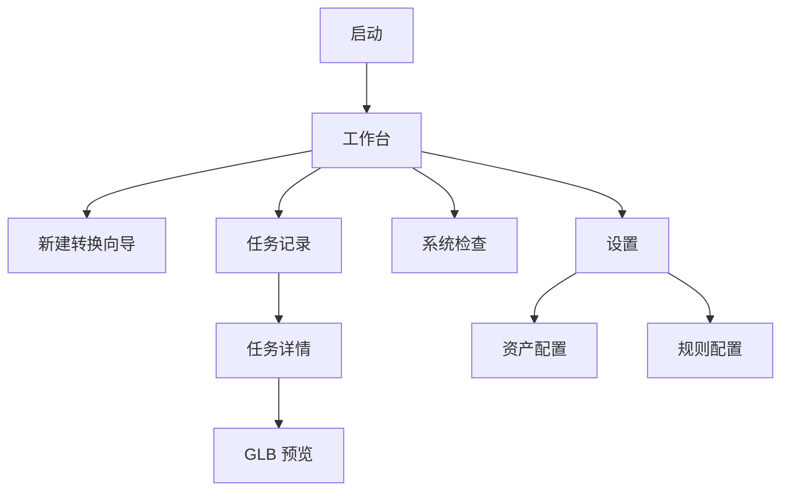
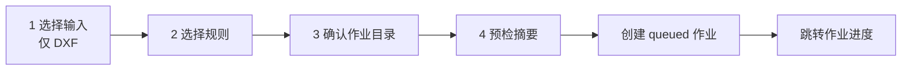
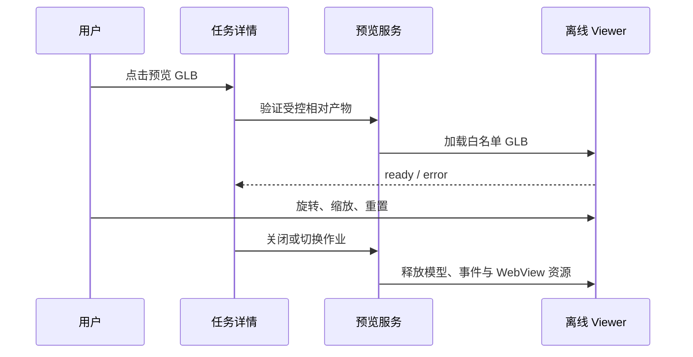

# Scene Builder Desktop UI 页面设计（规划）

## 页面集与共同规则

以下均为 Windows 10/11 MVP 的**规划页面**，当前仓库未实现 Avalonia UI。所有文字使用中文；状态颜色必须同时配合图标和文本，键盘可达并适配系统缩放。界面不显示客户图纸内容、令牌、绝对开发机路径或未脱敏的资产目录。

| 页面 | 目的 | MVP 行为 |
| --- | --- | --- |
| 工作台 | 概览与入口 | 显示最近作业、Doctor 摘要、新建转换 |
| 新建转换向导 | 创建 DXF 作业 | 选择 DXF、规则、作业位置并确认 |
| 作业进度 | 观察与取消 | 显示状态、阶段、进度、日志摘要 |
| 任务记录/详情 | 查询历史与产物 | 筛选本地记录，打开脱敏详情与产物 |
| 规则配置 | 管理规则文件入口 | 校验/选择规则，不在 UI 重定义领域规则 |
| 资产配置 | 管理 Catalog/Binding 入口 | 在 SB-11A 稳定后才接入，显示未配置状态 |
| 系统检查 | 检查 .NET/Blender | 调用未来 Doctor 服务，不安装或下载工具 |
| 设置 | 保存本地偏好 | Blender 路径、外部查看器和作业根策略 |
| GLB 预览 | 查看已验证 GLB | DESKTOP-00 验证后启用，失败使用外部查看器 |

DWG 出现在任意输入选择器时必须标记“暂不支持”，禁用开始按钮并提供 CAD 支持矩阵链接；这不是对现有 DWG 能力的新增声明。

## Shell、启动与导航

主窗口采用固定导航栏与内容区：工作台、任务记录、规则配置、资产配置、系统检查、设置。新建转换为主内容流程，不打开无边界的并行转换窗口。导航离开运行中作业详情不取消作业；关闭主窗口时另行执行关闭确认。

## 新建转换向导

1. 选择输入：文件选择器仅默认 DXF；若用户选择 DWG 或未知格式，显示不支持/无效原因，不创建作业。
2. 选择规则：显示被选择的规则文件名与校验结论；规则内容继续遵循既有规则配置契约，界面不以表单替代其语义。
3. 确认位置：默认由未来本地存储服务生成 JobId 隔离目录；用户可查看但不能选择仓库根目录、`src/` 或 `tests/` 作为运行时输出。
4. 预检：汇总输入、规则、Doctor 摘要和空间可用性。任何未配置/不支持项使用明确状态，不能显示“成功”。

点击开始后先持久化 queued 元数据，再向 `IDesktopJobRunner` 申请执行；单并发忙碌时保留 queued 状态或提示等待，不并行启动 Blender。

## 作业详情、进度与状态文案

进度页展示三个不同字段：`JobStatus` 是 queued/running/succeeded/failed/canceled 等生命周期结论，`JobStage` 是当前应用层阶段，`JobProgress` 是百分比、提示与时间快照。百分比未知时显示“正在处理”，不能编造 100%。日志区域只显示当前作业的 UTF-8 文本和脱敏摘要；原始失败信息以可复制但不默认外传的方式呈现。

取消在 queued/running 时可用，点击后显示“正在请求取消”；最终状态只有在应用层收敛后更新。用户从任务详情点击预览仅能打开完成且通过产物校验的 GLB。失败、取消或未配置作业可打开日志与建议，但不得显示产物可用。

## GLB 预览交互

DESKTOP-00 成功前，预览页显示“技术验证未完成”，提供外部查看器/已配置 Blender 的受控打开动作。成功后仍必须限制 Viewer 只能读取当前作业已验证的相对产物；.NET/JS 通信只传递命令、状态和允许的产物标识，不拼接任意文件 URL。

## UI 验收

- 在 Windows 10/11、100% 与高 DPI 下，导航、向导、进度、失败和空状态可读可操作。
- DXF 可进入预检；DWG 始终显示暂不支持且不能启动转换。
- 运行中只允许一个 Blender 相关作业；取消、导航和关闭确认不会冻结窗口。
- 预览验证失败时无内嵌伪预览，回退路径和错误原因清晰。
- UI 自动化覆盖主导航、向导禁用条件、取消确认和关闭确认；视觉与发布手工检查留存脱敏证据。
