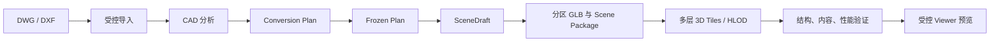

# 大厂区 3D Tiles 产品规格与验收基线

## 1. 产品定位与端到端目标

Scene Builder 面向大型工业厂区数字孪生场景：用户在 Windows Avalonia 工作台导入 DWG 或 DXF，完成 CAD 结构分析、受控参数调整、冻结转换计划、场景生成、分区、场景包、3D Tiles、产物验证与预览。最终目标是可用于大型厂区展示的本地 3D Tiles 场景，而不是仅生成语法合法的 `tileset.json`。

目标链路为：

```text
DWG / DXF
  → 受控导入
  → CAD 分析（Layer / Block / 实体 / Bounds / 单位 / 诊断）
  → Avalonia 参数工作台
  → Frozen Conversion Plan
  → SceneDraft
  → Blender 单体 GLB
  → 空间分区
  → Scene Package
  → 大型厂区 3D Tiles
  → 产物验证
  → Viewer 预览
  → 可选 IDTS / Cesium / Three.js 集成
```

DWG 支持、真实复杂 DXF 支持、Avalonia、Viewer 与 IDTS 接入均仍受各自支持闸门约束。本规格不授权实现这些能力。

## 2. 当前事实与状态

当前 SB-12A 是**已验证的“确定性空间分区 GLB 的 3D Tiles 1.1 索引封装”**：它从已验证 `scene-package.json` 读取成功分区，生成本地 Cartesian、meters、Z-up 的两层 `tileset.json`。Root 无 content、`refine="ADD"`；每个分区为直接引用 GLB 的 Leaf，Leaf `geometricError=0`；常规分区稳定排序，Global 分区固定在末尾；Tile Bounds 使用 `ContentBounds`；URI 和 GLB 均经二次验证；生成采用临时文件验证后原子发布。

这不等于完整大型厂区 HLOD 方案。当前尚未实现：多层 Tile 树、HLOD、低模/LOD、Mesh 简化、Draco/Meshopt、隐式分块、Metadata、动态大场景调度、Viewer 产品、WGS84/ECEF/地理配准、Root transform、Cesium/IDTS 集成、缓存或增量构建。

| 能力 | 当前状态 | 说明 |
| --- | --- | --- |
| SceneDraft → XY 网格分区 | Validated | 固定米制网格、稳定 ID、Global 回退与严格 Bounds。 |
| 分区 GLB → Scene Package | Validated | 顺序 Blender、staging、严格索引、验证和原子发布。 |
| Scene Package → Root + Leaves tileset | Validated | 本地 Cartesian 3D Tiles 1.1，直接 GLB 内容。 |
| 多层 tileset / HLOD | Planned | 没有现有树、代理内容或误差策略实现。 |
| 大型厂区生产就绪 | Target | 必须由 LARGE-00 至 LARGE-04 的证据证明，不能因 SB-12A 通过而声明。 |

## 3. 目标交付物与明确非目标

大型厂区目标交付物包括：可验收的大样本、可复现的转换记录、可解释的多层 Tile 树、经过验证的内容层级、性能与内存数据、Viewer 验收结论和可选集成边界。

本阶段不承诺 AutoCAD 编码、BIM 全语义转换、人工美术建模、云端多人协作、任意 CAD 格式、任意规模数据集或 IDTS 前端实现。未通过验证的 Target 不能标为 Supported、Validated 或 Production Ready。

## 4. 目标数据流与职责



Application 负责 Analyze、计划校验、Build、阶段进度、取消和诊断；Domain 保持不依赖 CAD、Blender、Tiles 或 Viewer；Desktop 只编辑受控计划并显示结果；Tiles 层只能消费已验证 Scene Package。大厂区 HLOD 不能让 ViewModel 或 Viewer 重算 CAD、篡改冻结计划或绕过产物验证。

## 5. 验收样本与证据

验收必须使用 Small Factory、Medium Factory、Large Factory 与 Stress/Boundary 四类脱敏样本。公开仓库只保存样本 ID、版本、文件大小区间、SHA-256 前缀、运行环境、工具版本、命令、状态、指标和诊断摘要；不得提交客户图纸、绝对路径、图层/Block 原文、坐标、资产或凭据。

每次验收记录至少包含：输入规模、CAD 实体数、Layer/Block 摘要、Bounds、分区数、单 Tile GLB 大小、总 Scene Package 大小、总 tileset 大小、转换阶段耗时、峰值内存、失败/取消情况、Viewer 加载结果、输出哈希和工具版本。样本必须可重复运行；失败必须保留明确的非成功状态和诊断，不能用 Warning 掩盖失败。

## 6. 大厂区验收维度

| 维度 | 最小验收内容 | 当前状态 |
| --- | --- | --- |
| 输入完整性 | 文件类型、版本、单位、Bounds、Layer/Block/实体摘要与真实样本覆盖 | Target |
| 分区正确性 | 网格边界、跨区归属、Global 使用、分区计数和稳定顺序 | Validated 基础能力 |
| Tileset 正确性 | JSON、Root/Leaf、ContentBounds、URI、GLB 二次校验、原子发布 | Validated 基础能力 |
| 树与 HLOD | 多层结构、父级代理内容、误差策略和层级完整性 | Planned |
| 资源预算 | 单 Tile GLB 大小、总包大小、Tile 数量、网格/纹理/Drawing Call 预算 | Target |
| 性能 | 分析、构建、发布、Viewer 首次加载、平移/缩放、峰值内存 | Target |
| 可靠性 | 取消、超时、部分失败、重复性、输出隔离、诊断与隐私 | Partial |
| Viewer | 加载、定位、卸载、错误、资源释放和大场景行为 | Planned |

Target 阶段的阈值必须在 LARGE-00 以测量数据确认，不能在无样本和无 Viewer 的情况下写成 Production Ready。所有指标同时记录 Target 与实际值，并明确 `Validated`、`Target` 或 `Unverified`。

## 7. 多层 Tile 树与 HLOD 方案

候选方案：

| 方案 | 优点 | 风险 | 结论 |
| --- | --- | --- | --- |
| 固定语义层级 | Factory Root → Zone/Workshop → Spatial Partition → Detail Content，可解释且便于厂区运营定位 | 需要可验证的 Zone/Workshop 来源 | 推荐为产品树骨架。 |
| Quadtree | 对平面密度自适应 | 边界、稀疏区和语义解释复杂 | 仅在 LARGE-01 作为可选实现比较。 |
| 语义区域加网格 | 兼顾厂房/区域与网格内容 | 需要明确定义区域归属和重复规则 | 可作为推荐骨架的叶层实现。 |

推荐目标树为：Factory Root → Zone/Workshop → Spatial Partition → Detail Content。每个层级必须定义内容是否存在、Bounds 来源、稳定 ID、`refine`、`geometricError`、子节点排序和失败行为。现有 SB-12A 的 Root + 分区 Leaves 仅是该树的零级基础，不能被重命名为 HLOD。

HLOD 目标要求：父 Tile 的代理内容必须有明确来源和验证规则；子 Tile 代表更高细节内容；`geometricError` 必须基于可测策略而非任意常数；`ADD` 或 `REPLACE` 的选择必须由实际内容关系证明。HLOD 未实现前，`geometricError` 不得被解释为视觉误差保证。

## 8. Global Partition 约束

`partition-global` 仅用于超过受控网格覆盖阈值、无法安全分配或经明确策略选择的对象。它不是大对象的静默垃圾桶，也不能无限增长后仍被视为大场景成功。

LARGE-00 必须建立 Global 数量、GLB 大小、对象数、Bounds 和对 Viewer 影响的预算；LARGE-01 必须定义超预算时的 Fail、明确降级或后续分层策略。任何 Global 超限、未知 Bounds、无效 URI、未验证 GLB 或未完成层级不得作为成功发布。

## 9. Viewer 与集成边界

Viewer 是独立产品验证对象。验收至少覆盖：加载已验证 tileset、首次视图、区域定位、缩放/平移、资源释放、加载失败、取消/关闭、受控相对路径、内存占用和长时间浏览。Viewer 不得接受任意 URL、文件路径或脚本。

IDTS、Cesium 和 Three.js 只是后续候选集成端；它们的版本、运行环境、离线要求、坐标解释、资源释放和许可证必须单独验证。没有 Viewer POC 前，不能把 3D Tiles 产物描述为可视化产品能力。

## 10. 诊断、隐私与报告

目标诊断需覆盖未验证样本、Tile 预算超限、Global 超限、层级未配置、代理内容无效、Viewer 验证缺失、树结构无效、资源预算超限和大场景验证失败。诊断代码稳定、全大写 ASCII；消息可为中文，但不得泄露图纸内容、图层/Block 名、绝对路径、资产路径、客户信息或完整 GLB/tileset 内容。

报告按项目、分析、计划修订、Build Job 和 Artifact 隔离；每次重建产生新 Job。性能和 Viewer 数据是脱敏证据，不替代 Domain `JobReport v0`。

## 11. 路线图与状态升级规则

`LARGE-00` 至 `LARGE-04` 是大型厂区路线：样本与基线、HLOD/多层 tileset、GLB 优化、增量/缓存、Viewer 验收。它们位于 CORE-04 与 DESKTOP 输出/预览工作之后，并行依赖 CAD-DXF-01、CAD-DWG-01 的真实输入支持证据。CORE-01 仍是下一项生产代码实施任务。

状态升级规则：当前 Root + Leaves 只能保持“Validated 基础 Tileset”；完成 LARGE-00 的真实样本与基准后才可称“已验证大厂区基础负载”；完成 LARGE-01、02 和受控 Viewer 验收后才可评估“大厂区可用”；只有大样本、性能、内存、稳定性、取消、隐私和 Viewer 全部达标后，才可提出 Production Ready 结论。
